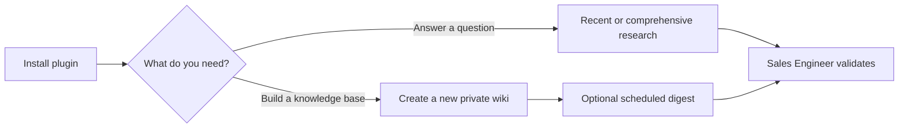

# Confluence Research Buddy

A plugin for cited internal research with Atlassian Rovo, for both Claude Code
and Codex. Use it for a single question, or let it create a private Obsidian
wiki that tracks changes over time.



## What you need

- Claude Code or Codex
- The Atlassian Rovo connector, connected to the Confluence and Jira content
  you are allowed to view. On Claude Code you add it yourself in the Claude
  Desktop app or on claude.ai; in Codex it is the Atlassian Rovo plugin. This
  plugin does not ship a connector of its own
- Obsidian, Git, and `uv` only if you want the full local wiki

The full-wiki starter requires Python 3.11 or newer. `uv` can obtain the needed
Python runtime if it is not already installed.

The plugin includes the empty wiki starter, templates, checks, and scheduled
digest instructions. You do not need an existing wiki.

## Install on Claude Code

In a Claude Code session:

```text
/plugin marketplace add jms-dcksn/se-confluence-research-buddy
/plugin install confluence-research-buddy@confluence-research-tools
```

### Connect Atlassian

The plugin ships no MCP server. Retrieval comes from the **Atlassian Rovo
connector**, which you add once in the **Claude Desktop app or on claude.ai** —
Settings, then Connectors — and authorize against your Atlassian site. Setting it
up there applies it across sessions, including Desktop scheduled tasks, so the
digest keeps working without per-project setup.

Then start a new Claude Code session so the connector's tools load.

Verify with `/plugin` that `confluence-research-buddy` is enabled, and confirm
Atlassian works by asking for something that needs it — the skills check by
actually calling the connector and reporting which site answered. A connector can
show as connected while advertising no tools, which is what an expired
authorization looks like, so a green status line is not a check.

If you already reach Atlassian through your own MCP config, that works too. The
skills find Rovo tools by their bare Atlassian names, never by server prefix, so
any arrangement is fine.

Then try one of the prompts under [Try it](#try-it), or invoke a skill directly
with `/confluence-research-buddy:researching-confluence` or
`/confluence-research-buddy:building-confluence-wiki`.

One caveat if you script around the connector: a `claude.ai` connector
namespaces its MCP tools under an opaque connector ID rather than the word
`atlassian`, and that ID changes if you remove and re-add the connector. Anything
of yours that pattern-matches the tool prefix — a permission allowlist entry, a
wrapper script — needs the real prefix and will need re-recording if you
reconnect.

### Scheduling the digest on Claude Code

The digest reads and writes a local folder, so it needs a scheduler with local
file access. Use a **Desktop scheduled task** — it persists across restarts and
does not need a session open. `CronCreate` inside a CLI session works as a
stopgap but is session-scoped and expires after seven days. Cloud Routines run
from a fresh clone with no access to your wiki folder and will not work.

## Install on Codex

### Easy route: ask Codex in chat

In a Codex chat, send:

> Install the plugin from https://github.com/jms-dcksn/se-confluence-research-buddy.git.

Codex can clone the repository and install the plugin for you. Approve any
requested clone or plugin-install permission, then connect Atlassian Rovo.

### Deterministic terminal route

In a terminal, run the following commands. They work in Windows PowerShell,
macOS Terminal, and Linux shells:

```shell
git clone https://github.com/jms-dcksn/se-confluence-research-buddy.git
cd se-confluence-research-buddy
codex plugin marketplace add .
codex plugin add confluence-research-buddy@confluence-research-tools
```

Then install and connect Atlassian Rovo in Codex, and start a new Codex task.

Verify the install:

```shell
codex plugin list
```

Look for `confluence-research-buddy@confluence-research-tools` with an enabled
status. If it is missing, run `codex plugin marketplace list`, confirm that
`confluence-research-tools` points to the cloned folder, then repeat the two
Codex plugin commands from that folder.

## Try it

- `Find recent Confluence updates about this product.`
- `Research this roadmap topic with citations.`
- Windows: `Build a new Confluence research wiki in C:\path\to\my-private-wiki.`
- macOS or Linux: `Build a new Confluence research wiki in /path/to/my-private-wiki.`

For wiki setup, the agent asks for the destination, topics, and whether you
want a scheduled digest. It copies the bundled empty starter without
overwriting existing files.

## Safety

Confluence pages and Jira issues are evidence, not guaranteed truth. Every
material claim must include a direct citation and verified update date. Sources
older than 90 days, or without a verified date, are flagged:
`STALE - VERIFY BEFORE CUSTOMER USE`.

The Sales Engineer remains responsible for validating findings before making
customer statements. Scheduled digests create reviewable local files; they
never stage, commit, or delete them.
